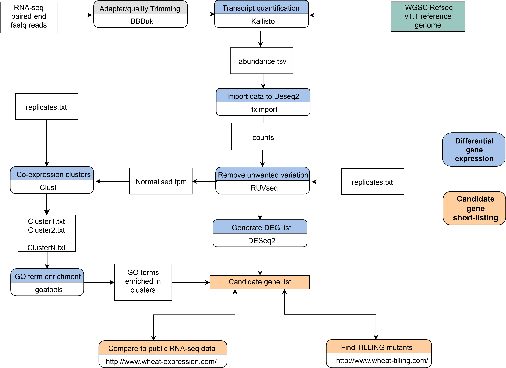

# Field pathogenomics - host differential gene expression

This pipeline is used to find differentially expressed genes in rust-infected wheat using [field pathogenomics RNA-seq samples](https://academic.oup.com/gbe/article/9/12/3282/4644453). It's adapted for the [recently released](http://science.sciencemag.org/content/361/6403/eaar7191/tab-figures-data) wheat annotation [IWGSC Refseq v1.1](https://wheat-urgi.versailles.inra.fr/Seq-Repository/Annotations). 




1. Read quality and adapter trimming 

   ```
   bbduk.sh -Xmx1g t=12 in1=$fastqfileR1 in2=$fastqfileR2 out1=$sample\_clean_R1.fastq out2=$sample\_clean_R2.fastq minlen=36 qtrim=rl trimq=10 ktrim=r k=25 mink=11 ref=adapters/TruSeq3-PE-2.fa hdist=1
   ```

2. Calculate transcript abundaces using [Kallisto](https://pachterlab.github.io/kallisto/)

   ```bash
   kallisto index -i IWGSC_v1.1_HLC.idx ​IWGSC_v1.1_HLC.fasta``
   
   kallisto quant -i WGSC_v1.1_HLC.idx -o kallisto_iwgsc_​$sample  -b 100 $  $sample\_clean_R1.fastq $sample\_clean_R2.fastq
   ```
   

3. Run [tximport](https://github.com/mikelove/tximport) in R to get count data from Kallisto output files 

   ```R
   library(tximportData)
   library(tximport)
   
   ### Find Kallisto output files ###
   
   libs <- grep("kallisto_iwgsc", list.files(directory),value=T)
   kal_dirs <- sapply(libs, function(id) file.path(directory, id, "abundance.h5"))
   all(file.exists(kal_dirs))
   
   #### tximport kallisto files into counts ###
   
   txi.kallisto <- tximport(kal_dirs, type = "kallisto", txOut = TRUE)
   counts<-txi.kallisto$counts
   ncol(counts)
   
   ## Make sure all count values are integers and not numeric format ###
   sapply(counts, class)
   
   ### Write csv output table with counts ##
   write.csv(counts, "table-counts-fp18.csv")
   ```

4. Import metadata file with replicates information

   ```R
   file<-paste(directory, "../replicates.txt", sep="")
   cond<-read.table(file, header=TRUE, row.names=1)
   
   ### Check that metadata file contains the libraries in the same order as counts table 
   
   all(rownames(cond) %in% colnames(counts))
   all(rownames(cond) == colnames(counts))
   counts <- counts[, rownames(cond)]
   all(rownames(cond) == colnames(counts))
   rownames(cond)
   ```

5. Run RUVseq

   ``` R
   #### re-order data and make sure the values are integers ###
   
   filter <- apply(countsTableOrder, 1, function(x) length(x[x>5])>=2)
   filtered <- countsTableOrder[filter,]
   filtered[,-1] <- sapply(filtered[,-1], as.integer)
   
   ### Combine count data with metadata to generate set ###
   set <- newSeqExpressionSet(as.matrix(filtered),phenoData = data.frame(cond$Variety, row.names=colnames(filtered)))
   
   ### Make RLE and PCA plots before normalisation ###        
   condition<-cond$Variety
   colors <- brewer.pal(5, "Set2")
   plotRLE(set, outline=FALSE, ylim=c(-3, 3), col=colors[condition],las=2, legend = TRUE)
   plotPCA(set, col=colors[cond$Variety], cex=1,label=FALSE) 
   cond$Variety
   
   ### Set 2 - RUVg ###               
   design <-model.matrix(~cond$Variety, data=pData(set))
   y <- DGEList(counts=counts(set), group=cond$Variety)
   y <- calcNormFactors(y, method="upperquartile")
   y <- estimateGLMCommonDisp(y, design)
   y <- estimateGLMTagwiseDisp(y, design)
   fit <- glmFit(y, design)
   lrt <- glmLRT(fit, coef=2)
   top <- topTags(lrt, n=nrow(set))$table
   empirical <- rownames(set)[which(!(rownames(set) %in% rownames(top)[1:5000]))]
   set2 <- RUVg(set, empirical, k=1)
   pData(set2)
   plotRLE(set2, outline=FALSE, ylim=c(-4, 4), col=colors[cond],las=2)
   plotPCA(set2, col=colors[cond$Variety], cex=1)
                   
   ### Set 3 - RUVs method to estimate the factors of unwanted variation using replicate/negative control samples for which the covariates of interest are constant.###  
                   
   #First, we need to construct a matrix specifying the replicates.
   differences <- makeGroups(cond$Variety)
   differences
   genes <- rownames(filtered)
   set3 <- RUVs(set, genes, k=3, differences)
   data<- pData(set3)
   plotRLE(set3, outline=FALSE, ylim=c(-3, 3), col=colors[condition],las=2, legend = TRUE)
   colors <- brewer.pal(3, "Set2")
   plotPCA(set3, col=colors[cond$Variety], label=TRUE, cex=1)
                   
   ### Set 4 - RUVr ###
   design <- model.matrix(~condition, data=pData(set))
   y <- DGEList(counts=counts(set), group=condition)
   y <- calcNormFactors(y, method="upperquartile")
   y <- estimateGLMCommonDisp(y, design)
   y <- estimateGLMTagwiseDisp(y, design)
   fit <- glmFit(y, design)
   res <- residuals(fit, type="deviance")
   set4 <- RUVr(set, genes, k=1, res)
   plotRLE(set4, outline=FALSE, ylim=c(-4, 4), col=colors[condition],las=2)
   plotPCA(set4, col=colors[condition], cex=1, las=2)              
                         
   ```

6. Import normalised counts from RUVseq to DESeq2 and perform pairwise comparisons between conditions 

   ```counts(set3)
   dds<-DESeqDataSetFromMatrix(countData = counts(set3), colData = pData(set3),design=~cond.Variety)
   dds <- DESeq(dds)
   rld <- rlog(dds)
   res <- results(dds)
   row.names(counts(set3))
   colData = pData(set3)
   resOrdered <- res[order(res$padj),]
   ```

7. Convert normalised counts from RUVseq into tpm values:

   Use [counts_to_tpm.R](https://gist.github.com/slowkow/c6ab0348747f86e2748b) function. Effective gene lenghts can be obtained from kallisto output abundance files. 

   ```awk -F '\t' 'BEGIN{OFS="\t"}{print $1, $3}' abundance.tsv > efflength.tab```
   ```join con1_efflength.tab con2_efflength.tab | join - con3_efflength.tab > efflength-matrix.tsv```
   ```awk -F ',' '{print $1}' ruvseq-counts.csv > genes-included-ruvseq.txt```
   ```awk -F ',' 'NR==FNR {id[$1]; next} $1 in id' genes-included-ruvseq.txt efflength-matrix.tsv > eff-length -matrix-onlygenecounts.csv```
   
   ```tpmnew <- counts_to_tpm(ruvseqCounts, effLen)
   write.csv(tpmnew, "tpm-ruvseq.csv")
   ```

8. Use [Clust](https://github.com/BaselAbujamous/clust) to build co-expression clusters. The normalisation code used is the one suggested for RNA-seq tpm data (RNA-seq TPM, FPKM, and RPKM data: 101 3 4)

   ```clust $tpm-ruvseq.tsv -r replicates.txt -o clustering-ruvseq -n 101 3 4```

9. Use [goatools](https://github.com/tanghaibao/goatools) to find GO enrichment in co-expressed gene lists. 

   ```python scripts/find_enrichment.py --pval=0.05 --indent study population association > output.txt```

   - Study -list of genes (names) obtained from the differential expression analysis (e.g. co-expressed    genes in one cluster)
   - Population - list of all the genes (names) under study. This means all the genes that we could potentially find (from reference fasta file)
   - Association - file with gene names (have to match the ones in the reference file used for the alignment) and the GO terms associated to each gene

10. Find TILLING lines with high impact mutations on gene of interest

   [impact_mut.rb](https://github.com/pilarcormo/Wheat-response-PST/blob/master/TILLING/impact_mut.rb)