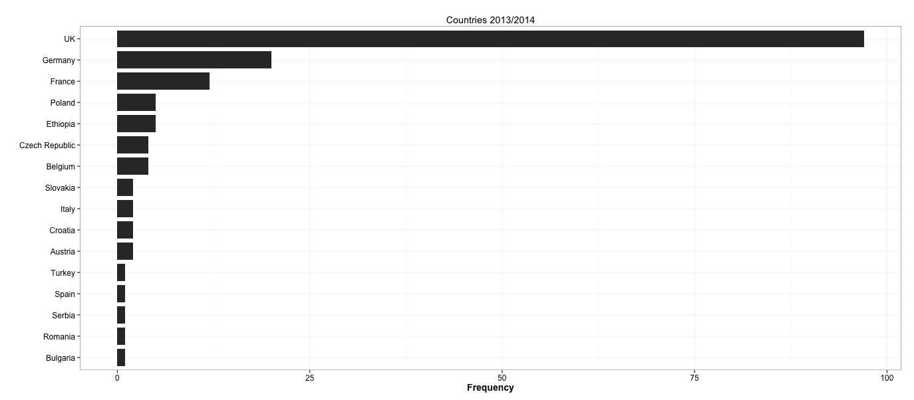
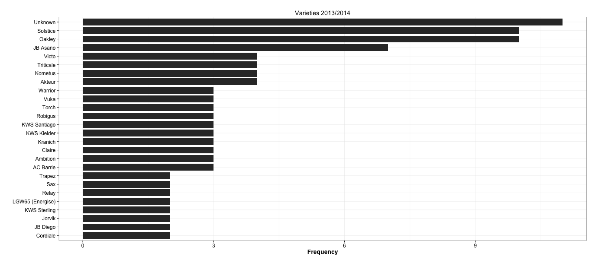
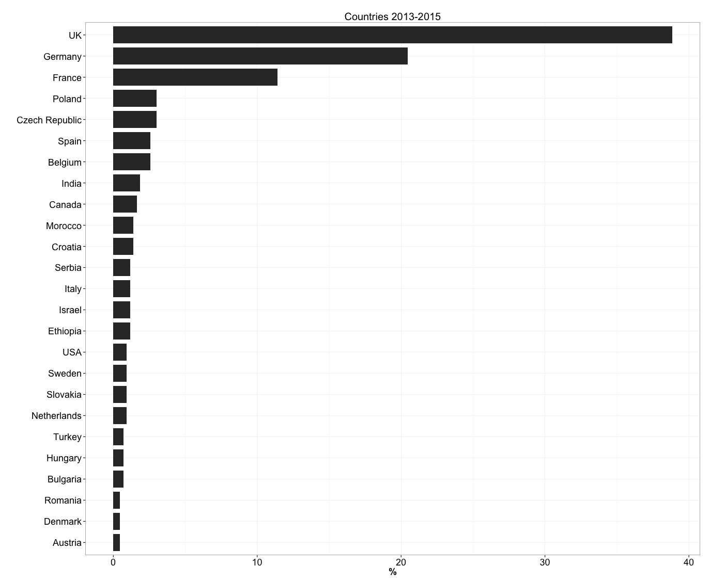
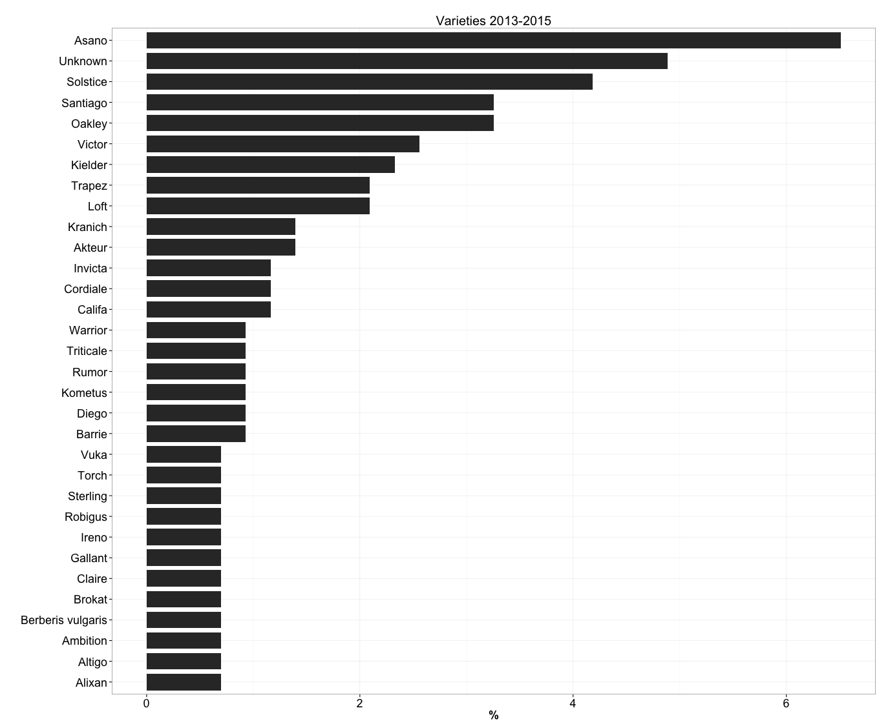

###64 total samples with RNA-seq completed between 2013 and 2014

######Choose varieties isolated more than once

###269 total samples selected for RNA-seq in 2015. 

TOTAL = 431 samples sequenced from 2013 to 2015

####Choose varieties isolated more than twice


