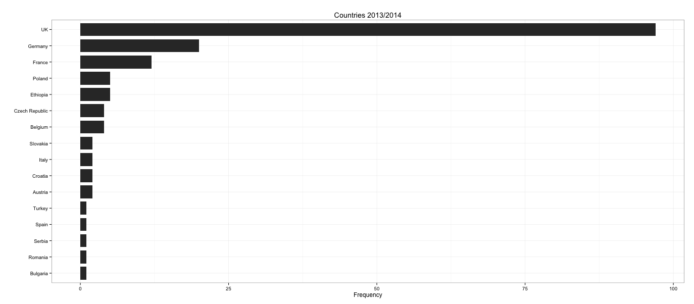
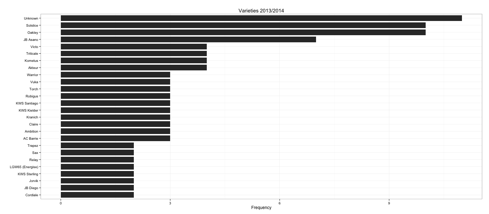

#####164 total samples with RNA-seq completed between 2013 and 2014


```
library(ggplot2)
samples <- read.csv("~/Desktop/RNA-seq_samples_1314.csv")
summary(samples)
```
```
location <- table(samples$Location)
df <- data.frame(table(samples$Location))
newdata <- df[order(df$Freq),] 
df2 <- data.frame(newdata$Freq, newdata$Var1)
p <- ggplot(df2, aes(x = reorder(newdata.Var1, newdata.Freq), y = newdata.Freq)) + 
  xlab("") + ylab("Frequency") +theme_bw() + geom_bar(stat = "identity",  width=.8) + ggtitle("Countries 2013/2014") + coord_flip()
``` 


######Choose varieties isolated more than once
``` 
df_variety <- data.frame(table(samples$Variety))
order <- df_variety[order(df_variety$Freq),] 
x <- order[order$Freq > 1,]$Var1
y <- order[order$Freq > 1,]$Freq
df2_variety <- data.frame(x, y)
```

```
p2 <- ggplot(df2_variety, aes(x = reorder(x, y), y = y)) + 
  xlab("") + ylab("Frequency") +theme_bw() + geom_bar(stat = "identity",  width=.8) + ggtitle("Varieties 2013/2014") + coord_flip()
  ```



